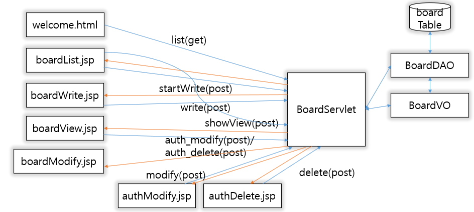

# web-review_board

This project is the movie review board in my university and to share information about newly screened movies
or to resonate after watching a movie.

Function:
- Board List(date, views)
- view detail
- write
- update(requiring auth)
- delete (requiring auth)

#Component Configuration

